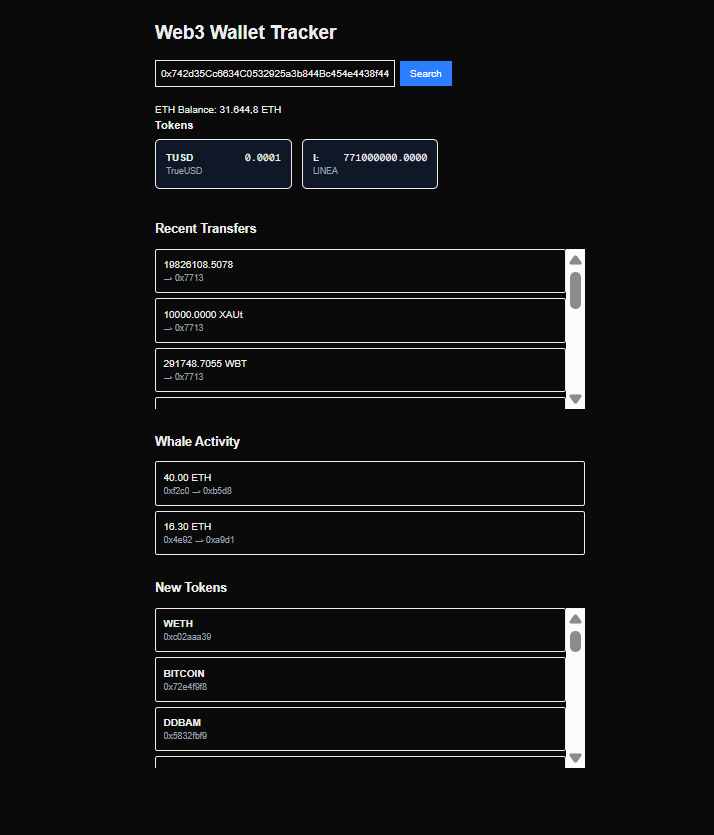

# Web3 Wallet Tracker

A full-stack Web3 analytics dashboard that allows users to inspect Ethereum wallets and on-chain activity.

Built with:

- Next.js
- Node.js
- Express
- Ethereum JSON-RPC
- Alchemy API

## Features

✔ Fetch ETH wallet balance  
✔ Retrieve ERC-20 token balances  
✔ Convert token balances using decimals  
✔ Display recent wallet transfers  
✔ Detect large "whale" transactions on Ethereum  
✔ Discover newly active tokens  
✔ Full-stack Web3 architecture  

## Architecture

Next.js frontend  
↓  
Node.js API  
↓  
Alchemy JSON-RPC  
↓  
Ethereum Blockchain

## Preview

## Running the project

### Backend

cd backend
npm install
node server.js

### Frontend

cd frontend
npm install
npm run dev

Open: http://localhost:3000
